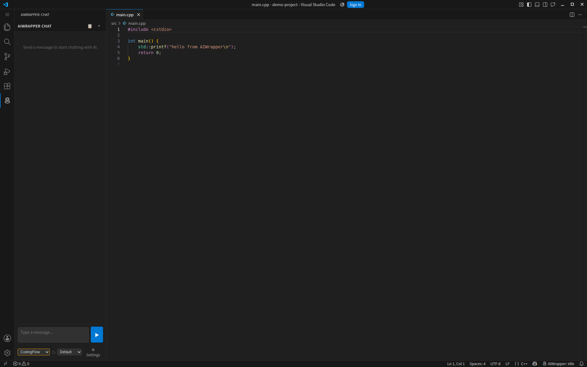
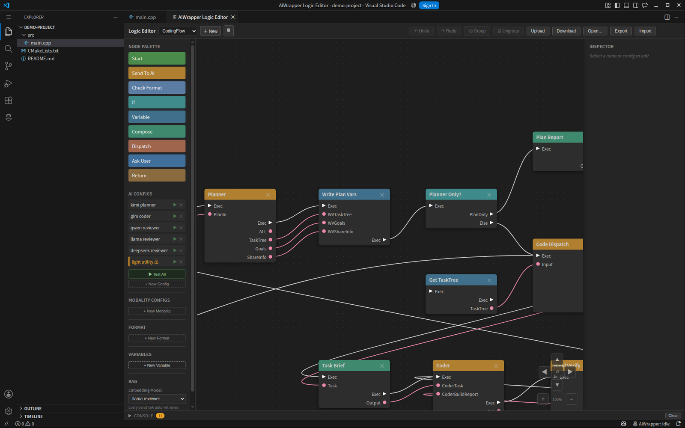

# CAGE

**A self-hosted AI coding assistant: a C++20 inference server plus a VSCode client.
Models, sessions, project index and generated artifacts all stay on your own hardware.**

> **Proprietary software.** Copyright (c) 2026 real0000. All Rights Reserved.
> This repository distributes compiled packages and documentation; it does not
> contain the source code, and the source code is not for sale.

## Licensing

A **Commercial Licence** is an organisation-wide (site) licence: install and run
it on as many machines as you like within one company, for your own internal
use. No per-seat, per-GPU or per-server counting.

| | |
|---|---|
| Scope | One legal entity and the entities it controls; unlimited installations |
| Use | Your own internal business purposes, including building your own products |
| Version | One major version — `1.x` includes every `1.x` release, forever. `2.x` is a separate product |
| Not included | Offering CAGE's functionality to third parties as a hosted service, API, or service bureau — that needs a separate agreement |

Free evaluation builds are available for testing, and may not be used in
production.

Full terms: **[LICENSE](LICENSE)**. Enquiries, including hosted-service and OEM
terms: <https://github.com/real0000>

---

## Downloads

| Package | Platform | Contents | Where |
|---|---|---|---|
| `cage-server-0.1.1-linux-x64.tar.gz` | Linux x86-64 | Inference server, node agent, control plane, model downloader, Python workers | [Releases](../../releases) (194 MB) |
| [`cage-0.1.1.vsix`](dist/cage-0.1.1.vsix) | VSCode ≥ 1.85 | The editor client | `dist/` in this repository |

Installation: **[doc/server-install.md](doc/server-install.md)** — Docker or
native — then **[doc/extension-install.md](doc/extension-install.md)** for the
editor client.

---

## Overview

```
   VSCode extension ──┐
                      ├── WebSocket + HTTP ──► CAGE Server ──► local models / GPUs
   native client    ──┘                              │
                                                     ├── llama.cpp (in-process)
                                                     ├── Python workers (multimodal)
                                                     └── multimodal workers
```

The server owns everything expensive: model loading and placement, the agent
loop, retrieval, and the multimodal pipelines. The client is a thin editor
front end that renders the conversation and executes tool calls locally.



*The chat panel runs inside VSCode. The selector at the bottom picks which
logic graph drives the conversation.*

## Features

### Local inference, multiple backends

Models run through one adapter with three backends: in-process **llama.cpp**
for GGUF (vision included, via an `mmproj` projector), a lazily spawned
**vLLM** subprocess for safetensors — or, where vLLM is not installed, an
automatic in-memory **conversion to GGUF** so those weights still run — and
**remote** cloud endpoints (OpenAI, Anthropic, Gemini). Nothing loads until the
first request that targets it, and
a RAM/VRAM budget evicts the least recently used model when a new one does not
fit.

A model's `<path>` is a *directory*: every `*.gguf` inside it becomes a
selectable quantization, and safetensors directories can be quantized at load
time (4bit NF4 / fp4, 8bit, bf16, fp16, fp32).

### Multi-GPU placement

Placement is decided from the machine's actual topology — NVLink cliques, free
VRAM per card, and whether the model is dense or mixture-of-experts. Layer
split, tensor split and expert CPU offload are chosen automatically; you pick
the GPUs, per AI config.

### Logic Graph instead of one fixed agent loop

The agent's behaviour is an explicit, executable graph edited visually in
VSCode: prompt nodes, format checks, dispatch, loops with re-entry, and
user-decision nodes that pause the run to ask you a question. Each node can
choose its own model, quantization, GPU set and sampling parameters — so a
cheap fast model can plan and a large model can write the code, in one run.



*A coding workflow in the Logic Editor. Left: the node palette, the AI configs
the graph's nodes bind to, and its variables. Each config names its own model
and parameters.*

### Tools run in your editor

Reading and writing files, applying patches, running terminal commands,
building projects and opening files all execute in VSCode, with per-tool
approval. **MCP** servers (stdio, SSE, streamable-HTTP) can be attached, and
their tools are offered to the model alongside the built-in ones.

### Retrieval over your project

The client pushes a full index and then incremental deltas as you edit. Chunking
is tree-sitter AST-aware with a line-window fallback, embeddings are computed
on the server, and vectors persist per project in an hnswlib store. Any node in
the graph can retrieve top-k chunks for its prompt.

### Multimodal

Image generation, text-to-speech, audio and music generation, and image-to-3D
mesh pipelines, each isolated in its own Python worker process with its own
environment and GPU visibility.

### Multi-user

Accounts, personal access tokens and per-user sessions with token accounting,
logic graphs that are either private to their owner or shared, and a
control-plane web UI for managing accounts, nodes and model downloads across
several machines.

---

## Requirements

| | |
|---|---|
| Server, either way | Linux x86-64; NVIDIA driver + CUDA 12. GPUs from compute capability 7.0 (V100, RTX 20xx) through 9.0+ (H100, RTX 50xx) — see [supported GPUs](doc/server-install.md#supported-gpus). CPU-only works, slowly |
| …via Docker | Docker with Compose v2, and the NVIDIA Container Toolkit for GPU access. Nothing else on the host |
| …natively | glibc 2.38+ (Ubuntu 24.04 or newer), plus MySQL for accounts and Python 3.10+ for the workers |
| Client | VSCode 1.85+ |

## Documentation

| Document | Contents |
|---|---|
| [doc/server-install.md](doc/server-install.md) | **Start here** — Docker or native, then the native path in full: configuration, workers, database, TLS, troubleshooting |
| [doc/server/docker.md](doc/server/docker.md) | The Docker path — one `docker compose up`, with models, database and config as host folders |
| [doc/extension-install.md](doc/extension-install.md) | Installing the `.vsix`, connecting to a server, logging in, first use |
| [doc/server/](doc/server/README.md) | Server guide — node agent, inference server, control plane: what each owns, models, backends, modalities, retrieval, accounts, multi-node |
| [doc/client/](doc/client/README.md) | Client guide — both windows panel by panel, every node type, every configuration parameter, RAG, tools and staging, all settings |

## License

Proprietary — Copyright (c) 2026 real0000. All Rights Reserved.
Licensed, not sold; no source code is included or sold. See [LICENSE](LICENSE)
for the full terms, and [Licensing](#licensing) above for what a purchase covers.

CAGE incorporates open-source components, all under permissive licences; they
are listed with their copyright notices in
[THIRD-PARTY-NOTICES.md](THIRD-PARTY-NOTICES.md). Model weights and the Python
worker environments are **not** covered by either document — those are chosen
and installed by the operator, and several carry commercial restrictions. See
[model licences](doc/server/server/models.md#model-licences-are-yours-to-check).
