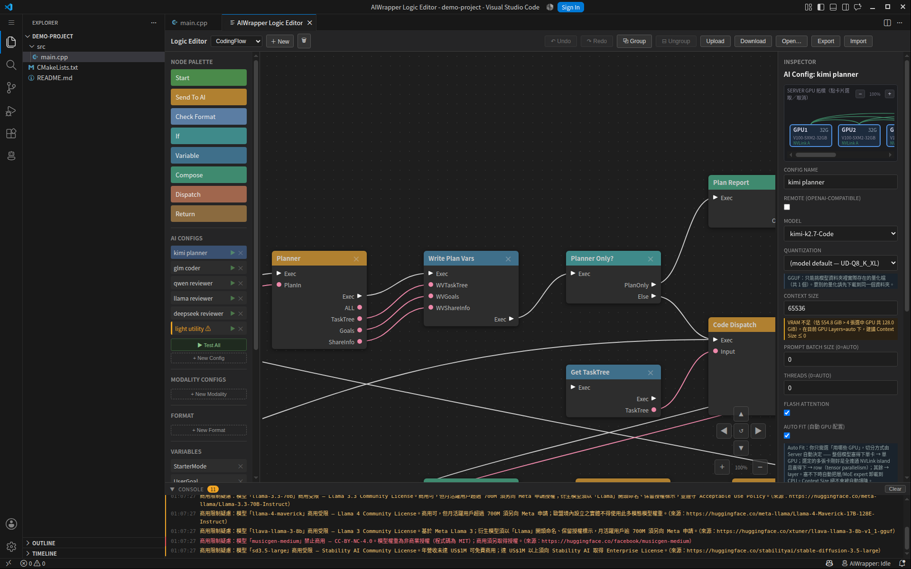

# AI Configs

An AI config is a named bundle of "which model, loaded how, sampled how". Nodes
reference it by name, so several [Send To AI](nodes.md#send-to-ai) nodes can
share one config, and one graph can mix a small fast model for routine steps
with a large one for the hard step.

Configs live in the **AI CONFIGS** section of the Logic Editor sidebar.

*Selecting a config opens it in the Inspector. The GPU picker at the top shows
the server's actual cards and how they are linked; the fields below it are
described on this page, each with the warning that applies to it.*

---

## Load-time versus per-request

The single most useful thing to understand here.

**Load-time** parameters are fixed when the model is loaded into the worker.
The worker is long-lived and loads the model once, so changing one of these
does not affect a running worker — the model has to be unloaded and loaded
again before the new value means anything. The editor's console warns you when
you change one.

**Per-request** parameters go out with every inference call and take effect
immediately.

| Scope | Parameters |
|---|---|
| Load-time | Quantization, Context Size, Prompt Batch Size, Threads, Flash Attention, GPU Layers, KV Cache Type, Split Mode, CPU MoE Layers, Auto Fit, GPU Visibility |
| Per-request | Temperature, Top K, Top P |

## Model

| Field | Meaning |
|---|---|
| Model | Picked from what the server reports. The server scans each model directory listed in its `config.xml` |
| Quantization | Which quantization to load |

Quantization behaves differently by format, because the server treats a model's
path as a *directory*:

- **GGUF** — every `.gguf` file in the directory is one quantization. You can
  only choose one that is actually there; adding another means downloading that
  file into the same directory. No config change needed.
- **safetensors** — the weights are one set and quantization happens at load
  time, so the whole list is available: 4bit (NF4), 4bit-fp4, 8bit, bf16, fp16,
  fp32.

Leave it empty to use the model's default — the one named in the server's
`config.xml`, or the smallest one found.

## Remote endpoints

Switch a config to **remote** to call an OpenAI-compatible endpoint instead of a
local model.

| Field | Meaning |
|---|---|
| Remote URL | Base URL with no trailing slash, e.g. `https://api.openai.com` or `http://localhost:11434/v1` |
| API Key | Sent as `Authorization: Bearer …` when set |
| Model | The remote model ID, as a free string |

In remote mode the server loads nothing locally and every load-time parameter
below is ignored. The test button checks `/v1/models`; inference posts to
`/v1/chat/completions`.

## Context and batching

| Field | Default | Meaning |
|---|---|---|
| Context Size | — | Context window in tokens. Decides how large the KV cache is, so it cannot change without a reload |
| Prompt Batch Size | 0 | Tokens per prompt-processing batch. `0` uses the backend default (2048) |
| Threads | 0 | CPU threads for inference. `0` lets the backend decide from the core count |
| Flash Attention | on | Faster attention with a smaller KV cache footprint |
| KV Cache Type | `f16` | KV cache precision: `f16`, `q8_0`, `q4_0`. Quantizing the cache buys context length at some quality cost |

Context size interacts with everything else: a long context reserves a large KV
cache, which is often what pushes a model out of VRAM.

## GPU placement

This is where a model that "does not fit" usually becomes one that does.

| Field | Default | Meaning |
|---|---|---|
| Auto Fit | off | Let the server decide placement — see below |
| GPU Layers | -1 | Layers to offload. `-1` estimates from free VRAM, `0` is CPU-only |
| Split Mode | `layer` | How to spread across GPUs: `layer` splits by layer, `row` is tensor parallelism, `tensor` is the newer meta-device split (experimental, architecture-dependent), `none` keeps the whole model on one GPU |
| CPU MoE Layers | 0 | For mixture-of-experts models, keep expert weights on the CPU: `0` off, `N` for the first N layers, `-1` for all. Non-MoE models ignore it |
| GPU Visibility | inherit | Which GPUs this model may use — indices (`0,1`) or UUIDs. Empty inherits the server default |

**`-1` can silently mean CPU.** It is an estimate from free VRAM, and on a host
where that reading fails it resolves to 0 — the model loads entirely on the CPU
with no error, just an order of magnitude less speed. The server log shows the
resolved value (`n_gpu_layers=-1->0`). Prefer Auto Fit, or set the count
explicitly.

**Auto Fit** is the recommended starting point. It measures what the model
actually needs with a dry run, reads the machine's NVLink topology, and picks
the split mode, layer count, tensor split and MoE offload itself. You choose
which GPUs to use; it decides how. Whole model fits one card → single GPU. The
chosen cards form a fully connected NVLink island and it fits → `row`.
Otherwise → `layer`. Context size is always honoured exactly and never quietly
reduced.

Auto Fit needs Split Mode `layer` or `none`, and it overrides GPU Layers and
CPU MoE Layers.

**GPU Visibility only applies to the Python worker backend**, because it is an
environment variable set when the worker process starts. The in-process
llama.cpp backend fixes its device list when the server starts, so use Split
Mode to control placement there.

## Sampling

| Field | Meaning |
|---|---|
| Temperature | Randomness. Lower is more deterministic |
| Top K | Sample only from the K most likely tokens |
| Top P | Sample from the smallest set of tokens whose probability sums to P |

These are per-request, so editing them affects the very next call.

## Testing a config

Each config has a ▶ button, and **Test All** runs every one.

The test runs in two stages: first it validates the settings, then it actually
loads the model with them. That second stage is the point — it is how you find
out whether a placement fits in VRAM without discovering it halfway through a
real run. Results, warnings and licence notes appear in the editor's console.

## Licence flags

The server records the upstream licence of each model. Configs pointing at a
model with commercial restrictions are flagged in the console, with the
restriction spelled out and a link to the model card. Models are marked free,
restricted, or non-commercial.

---

[← Logic Editor](logic-editor.md) · [Modality Configs](modality-config.md) · [Client Guide](README.md)
