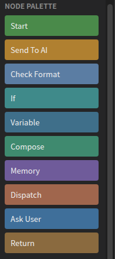

# Logic Editor

The Logic Editor is where you design what the agent does. A logic graph replaces
the single fixed "think, call a tool, repeat" loop most assistants have: you lay
out the steps, decide which model runs each one, and wire the branches yourself.

Open it with **CAGE: Open Logic Editor**.

---

## Anatomy

| Area | What it is |
|---|---|
| Graph selector (top left) | Which graph you are editing. `+ New` creates one, the bin deletes it |
| Toolbar (top right) | Undo / Redo, Group / Ungroup, Upload / Download, Open / Export / Import |
| Node palette (left) | Drag or click to add a node — see [Nodes](nodes.md) |
| Sidebar sections (left, below) | The reusable configurations the graph's nodes reference |
| Canvas (middle) | The graph. Drag nodes, drag pin to pin to connect, scroll to pan, zoom controls bottom right |
| Inspector (right) | Settings for whatever is selected |
| Console (bottom) | Warnings and results — model licence flags, config test output, load-time parameter notices |

## The sidebar sections

Each section is a list of named, reusable definitions. Nodes reference them **by
name**, so renaming one updates every node that uses it.

| Section | What it defines | Detail |
|---|---|---|
| AI Configs | A model plus how to load and sample it | [AI Configs →](ai-config.md) |
| Modality Configs | Image / speech / audio / music / 3D generation targets | [Modality Configs →](modality-config.md) |
| Format | Output shapes: JSON, required keys, regex, non-empty | [Format Configs →](format-config.md) |
| Variables | Named state that lives for one run of the graph | [Variables →](variables.md) |
| RAG | Which config embeds your project, enabling retrieval | [RAG →](rag.md) |

**Test All** runs every AI config's connectivity test at once. Each config also
has its own ▶ test button, which validates the settings and then actually loads
the model — useful for finding out whether a placement fits in VRAM before a
real run depends on it.

## Wiring

Connections carry two different things, and the editor keeps them apart:

- **Exec pins** (triangles) are execution order. One node finishes, the next
  begins. Exec only connects to exec.
- **Data pins** (circles) carry values. A data pin connects to another data pin
  of the same type, or to/from `string`, which is the untyped channel.
- **Asset pins** (teal circles) carry files rather than text — chat attachments
  and generated images/audio/meshes. They connect to each other, to any modality
  content type, and to/from `string`. Any pin you add can be switched between
  text and asset in the inspector.

A connection may rename as it crosses: the output pin's name is the key on the
sending side, the input pin's name is the key on the receiving side. That is how
a node's `ALL` output becomes some other node's `PlanIn` input.

Execution starts at the chosen Start node and follows exec edges. Before a node
runs, its data inputs are pulled along data edges — so a [Variable](nodes.md#variable)
node can act purely as a value source with no exec wire attached at all.

Loops are allowed: an exec edge that goes back to an already-visited node clears
that node's visited mark and runs it again.

Every path must end at [End](nodes.md#end) or [Return](nodes.md#return). A path
that simply runs out of nodes is reported as an undeclared dead end.

## Groups

Select several nodes and press **Group** to collapse them into a single box with
its own input and output pins. Groups can nest. They are an editing convenience
only — the graph is flattened before it reaches the server, so grouping never
changes behaviour.

## Saving and sharing

The editor syncs the graph to the server as you work. If the server's copy is
newer than yours — someone else edited it, or another window did — a banner
offers **Use server's** or **Push mine**.

The toolbar covers the rest:

| Button | What it does |
|---|---|
| Upload / Download | Push this graph to the server, or pull the server's copy |
| Open… | Switch to another graph stored on the server |
| Export / Import | Write the graph to a JSON file, or read one back |

Graphs are owned: yours are private unless shared. Shared graphs appear in the
selector for everyone on that server.

---

## Where to go next

- [Nodes](nodes.md) — every node type, its pins and its settings
- [AI Configs](ai-config.md) — every model parameter and when it takes effect
- [Format Configs](format-config.md) — making the model return a fixed shape
- [Variables](variables.md) — carrying state between nodes
- [RAG](rag.md) — giving nodes your project as context

[← Client Guide](README.md)
