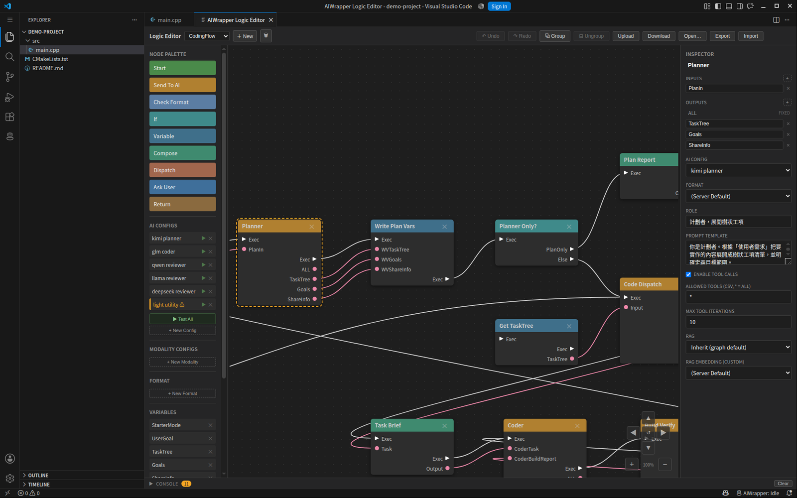

# Nodes

Every step in a logic graph is a node. This page describes each type: what it
does, the pins it exposes, and the settings the Inspector shows when you select
it.

Two pin kinds appear throughout:

- **exec** (triangle) — execution order. Exec only connects to exec.
- **data** (circle) — a value. Same type connects to same type; `string` is the
  untyped channel and connects to anything.

Pins marked *user-defined* are ones you add yourself in the Inspector. That is
how a node receives extra values: add an input pin, wire something into it, and
reference it by its pin name.

*Selecting a node fills the Inspector: its pins at the top, then the settings
described below. This one is a [Send To AI](#send-to-ai) node.*

| Node | One line |
|---|---|
| [Start](#start) | Entry point; hands the user's message to the graph |
| [Send To AI](#send-to-ai) | Calls a model — the workhorse |
| [Check Format](#check-format) | Validates a string and branches on the result |
| [If](#if) | Multi-case switch on a value or a variable |
| [Variable](#variable) | Reads and writes graph-level state |
| [Compose](#compose) | Builds a string from a template |
| [Dispatch](#dispatch) | Splits work into tasks and runs a subgraph per task |
| [Ask User](#ask-user) | Asks you a question — but only when the answer is genuinely yours |
| [Return](#return) | Ends one branch deliberately |
| [End](#end) | Ends the run and returns the result |

---

## Start

The entry point. The user's message arrives here.

A graph always has one Start named `Default`, which cannot be deleted. You may
add more, each with its own name, and pick between them in the chat panel's
Start selector — one graph, several ways in. A "plan only" entry and a "full
build" entry can share all the nodes downstream.

Start also synchronises the project index before the run begins, so retrieval
and file tools see current files.

| Pin | Type | Direction | Meaning |
|---|---|---|---|
| `Exec` | exec | out | Fires once, at the beginning |
| `PROMPT` | string | out | The user's message |
| `ASSET` | asset | out | Files attached to the message with 📎 (empty when there are none) |

`ASSET` is a separate wire on purpose: attachments only go to the nodes you
actually connect them to, so a vision model can look at the image while the rest
of the graph keeps working in plain text.

| Setting | Meaning |
|---|---|
| Start Name | The name shown in the chat panel's Start selector. Empty on the `Default` node |

---

## Send To AI

Calls a model and streams the answer back. Most graphs are mostly these.

The prompt is built from **Prompt Template**, where `{{pin}}` inserts the value
arriving on that input pin. Add input pins for whatever the prompt needs — a
plan, a file, a previous answer — and reference them by name.

If the node's **AI Config** names a [Modality Config](modality-config.md)
instead of an [AI Config](ai-config.md), the node generates an image, speech,
audio, music or a 3D mesh instead of text. In that mode tool calls, retrieval
and structured output are all bypassed, and `ALL` carries file paths.

Files arrive on **asset** pins, not text pins. What the node does with them
depends on the model it is running:

- a vision-capable model gets the images as real image content alongside the
  prompt;
- a text-only model gets a short list of what was attached and where each file
  is, so a node with file tools can still open them;
- under a modality config, an asset pin becomes a source-file parameter — that
  is how image-to-image and image-to-mesh get their input picture.

An asset pin referenced as `{{pin}}` in the template expands to that same short
list, never to the raw reference.

| Pin | Type | Direction | Meaning |
|---|---|---|---|
| `Exec` | exec | in / out | |
| `Asset` | asset | in | Files for this call — from Start's `ASSET`, or another node's output |
| *user-defined* | string / asset | in | Values for `{{placeholders}}` in the template, or more files |
| `ALL` | string | out | The whole answer. Becomes an image/audio/mesh path list under a modality config |
| `Asset` | asset | out | Under a modality config, the generated files — wire straight into another node's asset input |
| *user-defined* | string | out | With a `json_keys` format, one pin per key — the answer arrives already split |

| Setting | Default | Meaning |
|---|---|---|
| AI Config | — | Which [AI Config](ai-config.md) or [Modality Config](modality-config.md) runs this node |
| Format | — | A [Format Config](format-config.md). Turns on structured output, so the model must answer in that shape |
| Role | — | System role text for this call |
| Prompt Template | — | The prompt. `{{pinName}}` inserts an input pin's value |
| Enable Tool Calls | on | Whether the model may call tools in your editor |
| Allowed Tools | `*` | Comma-separated allow-list; `*` means every tool the client offers |
| Max Tool Iterations | 5 | How many tool round trips before the node gives up |
| RAG | Inherit | `Inherit` uses the graph's setting, `Off` disables retrieval here, `Custom` picks a different embedding config. See [RAG](rag.md) |
| RAG Embedding | — | The config used when RAG is set to Custom |

---

## Check Format

Validates the string on `Input` against a [Format Config](format-config.md) and
branches. On success `Output` carries the input through and `True` fires; on
failure `False` fires.

The usual shape is a retry loop: `Send To AI → Check Format`, with `False`
wired back to the model call so it tries again.

| Pin | Type | Direction | Meaning |
|---|---|---|---|
| `Exec` | exec | in | |
| `Input` | string | in | The string to validate |
| `True` | exec | out | Validation passed |
| `False` | exec | out | Validation failed |
| `Output` | string | out | The validated string, passed through |

| Setting | Meaning |
|---|---|
| Format | Which [Format Config](format-config.md) to validate against |
| Custom error message | Replaces the default message when validation fails |

---

## If

A switch. Cases are checked in order and the first one that holds fires its
branch; if none hold, `Else` fires. `Output` passes the input through on every
branch.

Each case reads either an input pin or a [variable](variables.md), and the
operators offered depend on the value type you pick:

| Value type | Operators |
|---|---|
| string | equals, not equals, is empty, is not empty, contains, not contains, starts with, ends with, matches regex |
| number | equals, not equals, is empty, is not empty, <, ≤, >, ≥ |
| bool | equals, not equals, is empty, is not empty, is true, is false |
| json | equals, not equals, is empty, is not empty, is valid JSON, has key, path equals |
| enum | equals, not equals, is empty, is not empty |

JSON cases take a **path** to address a value inside the document. String
comparisons can be made case-insensitive.

| Pin | Type | Direction | Meaning |
|---|---|---|---|
| `Exec` | exec | in | |
| `Input` | string | in | Default comparison source |
| `Case 1` … | exec | out | One per case, named as you name them |
| `Else` | exec | out | No case held |

Adding or renaming a case updates the output pins and keeps existing
connections attached.

---

## Variable

Reads and writes the graph's [variables](variables.md).

Each **item** names a target variable, an operation, and a source:

| Field | Options |
|---|---|
| Operation | `set` overwrites; `add` appends — numbers sum, strings concatenate, bools OR |
| Source | `constant` a fixed value, `node` an input pin on this node, `variable` another variable |

Add several items to write several variables in one node.

**Getter pins** are the other half. Add an output pin whose name matches a
variable, and downstream nodes can read the variable's current value straight
from it — no exec wire needed. The value is pulled at the moment the reader
runs, so it is always current.

| Pin | Type | Direction | Meaning |
|---|---|---|---|
| `Exec` | exec | in / out | Optional — a pure getter node needs neither |
| *user-defined* | string | in | Sources for items with source `node` |
| *user-defined* | string | out | Getter pins, named after a variable |

---

## Compose

Builds one string from many. The **Template** is free text where `{{pinName}}`
inserts an input pin's value and `{{variableName}}` inserts a
[variable](variables.md).

Use it to assemble a prompt from parts, or to format a report at the end of a
run. It does no validation — that is what [Format Configs](format-config.md)
are for.

| Pin | Type | Direction | Meaning |
|---|---|---|---|
| `Exec` | exec | in / out | |
| *user-defined* | string | in | Referenced as `{{pinName}}` |
| `Output` | string | out | The rendered string |

| Setting | Meaning |
|---|---|
| Template | The text, with `{{pin}}` and `{{variable}}` placeholders |

---

## Dispatch

Breaks a large request into a plan and then runs the subgraph hanging off `Step`
once per task. Dispatch itself does no work — the nodes downstream of `Step` do.

A **splitter** model turns `Input` into a tree: numbered items are sequential
steps, and `-` items inside a step are tasks that may run side by side. For each
leaf, `Step` fires with the task text on `Task` and its number on `Index`. When
every task is finished, `End` fires once and the main flow continues.

The splitter prompt is fixed and not editable. Its output is cleaned up before
parsing — chain-of-thought is stripped and only the plan block is read — so
reasoning models work here, but the token limit matters: a truncated plan
leaves half-finished reasoning behind and parses badly. Give
`Splitter Max Tokens` room, and make sure the splitter config's context is at
least prompt + that number.

| Pin | Type | Direction | Meaning |
|---|---|---|---|
| `Exec` | exec | in | |
| `Input` | string | in | The work to break down |
| `Step` | exec | out | Fires once per task |
| `Task` | string | out | This task's text |
| `Index` | string | out | This task's number |
| `Plan` | string | out | The whole parsed plan |
| `End` | exec | out | Fires once, after every task is done |

| Setting | Default | Meaning |
|---|---|---|
| Splitter AI Config | — | The model that writes the plan |
| Splitter Max Tokens | 4096 | Output cap for the plan. `0` removes the cap |
| Parallel | off | Run the tasks inside one `-` group concurrently |
| Max Parallel | 4 | How many at once when parallel is on |

---

## Ask User

Pauses the run to ask you something, before work is done on a wrong assumption.

The node does not simply ask. It first runs a model to decide whether a question
is warranted at all, and **most tasks need none** — that is the normal, correct
outcome. Questions are reserved for things that are genuinely yours to decide:

- the requirement is ambiguous and the readings lead to materially different work
- a constraint that changes the design is missing — target platform, data source,
  compatibility, scale
- a trade-off you should own, because it is a product, UX or policy preference

It deliberately does *not* ask about anything answerable from the code, the
request or ordinary convention; about implementation detail with an obvious
default; or for permission to run a tool, which has its own approval gate.

Each question is self-contained and comes with two to four concrete options when
the plausible answers can be enumerated. You pick one, or type your own if free
text is allowed. Answers arrive merged on `Answers`, ready to feed into a
prompt; `Asked` tells the graph whether anything was asked at all, so a
downstream [If](#if) can branch on it.

If nothing needed asking, or the wait timed out, `Answers` is empty and `Asked`
is `false` — the run continues either way.

| Pin | Type | Direction | Meaning |
|---|---|---|---|
| `Exec` | exec | in / out | |
| `Input` | string | in | The task being considered, used to judge what is unclear |
| `Answers` | string | out | The questions and your answers, merged. Empty if nothing was asked |
| `Asked` | string | out | `"true"` or `"false"` |

| Setting | Default | Meaning |
|---|---|---|
| AI Config | — | The model that decides whether to ask. Judgement, not prose — it runs at a low fixed temperature so the same input does not flip between asking and not asking |
| What counts as the user's call | — | Extra guidance specific to this flow, added to the built-in criteria |
| Max Questions | 3 | Upper bound, 1–10. It usually asks fewer |
| Offer "Other…" | on | Adds a free-text choice to every question |
| Answer Timeout | 600 | Seconds to wait per question, 30–3600 |

Put it after [Start](#start) and before the expensive work — the value is in not
building the wrong thing. Putting one in the middle of a long run interrupts you
for an answer you may no longer have context for.

---

## Return

Ends one branch on purpose. It says "this path is finished", as opposed to a
path that simply ran out of nodes, which the server reports as an error.

Use it on branches that fan out from [Dispatch](#dispatch), and on [If](#if)
branches that intentionally do nothing.

| Pin | Type | Direction |
|---|---|---|
| `Exec` | exec | in |

| Setting | Meaning |
|---|---|
| Note | Why this path stops here. Documentation for whoever reads the graph next |

---

## End

Ends the run and returns the result to the chat panel. There is exactly one End
node and it cannot be deleted.

| Pin | Type | Direction | Meaning |
|---|---|---|---|
| `Exec` | exec | in | |
| `Result` | string | in | What to return |

| Setting | Meaning |
|---|---|
| Result Keys | Which keys go back to the client. Empty returns everything |

---

[← Logic Editor](logic-editor.md) · [Client Guide](README.md)
