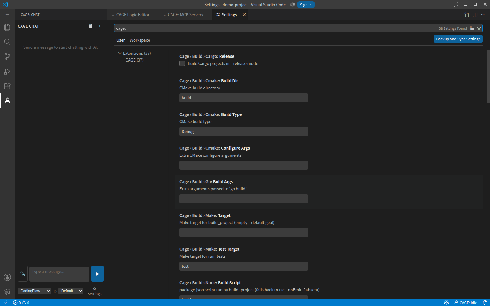

# Settings

Every setting the extension contributes, as it appears under `cage.*` in
VSCode settings. Search `cage` in the settings UI, or edit `settings.json`
directly.

---

## Server connection

| Setting | Default | Meaning |
|---|---|---|
| `cage.server.host` | `localhost` | Hostname only — no `http://` or `ws://`. The protocol comes from `tls` |
| `cage.server.port` | `15963` | Must match `<port>` in the server's `config.xml` |
| `cage.server.tls` | `false` | Use `https://` / `wss://`. The server needs a certificate configured |
| `cage.server.tlsRejectUnauthorized` | `true` | Verify the certificate. `false` accepts self-signed ones — still encrypted, no longer protected against interception |
| `cage.server.apiKey` | empty | Bearer token. Prefer **CAGE: Login**, which manages this for you |
| `cage.server.connectMaxAttempts` | 3 | Connection attempts before reporting failure |
| `cage.server.connectRetryDelayMs` | 1000 | Delay between attempts |

## Tool approval

See [Tools & Approval](tools.md).

| Setting | Default | Meaning |
|---|---|---|
| `cage.toolApproval.mode` | `ask` | Default mode: `ask`, `auto`, `deny` |
| `cage.toolApproval.perTool` | `run_terminal`, `build_project`, `run_tests` → `ask` | Per-tool overrides. `write_file` and `apply_patch` are absent on purpose: they only write to the staging area, so they run automatically and are reviewed together at the flush |
| `cage.toolApproval.timeoutSeconds` | 30 | Wait before a request lapses. `0` waits forever |

## Tool execution

| Setting | Default | Meaning |
|---|---|---|
| `cage.tool.outputThresholdKB` | 128 | Output past this is uploaded as a file instead of inlined |
| `cage.tool.commandTimeoutMs` | 120000 | Command timeout (2 minutes) |

## Build and test

Used by `build_project` and `run_tests`.

| Setting | Default | Meaning |
|---|---|---|
| `cage.build.timeoutMs` | 600000 | Build/test timeout (10 minutes) |
| `cage.build.cmake.buildDir` | `build` | CMake build directory |
| `cage.build.cmake.buildType` | `Debug` | CMake build type |
| `cage.build.cmake.configureArgs` | empty | Extra configure arguments |
| `cage.build.node.packageManager` | `auto` | `auto` detects from the lockfile |
| `cage.build.node.buildScript` | `build` | Script for `build_project`; falls back to `tsc --noEmit` |
| `cage.build.node.testScript` | `test` | Script for `run_tests` |
| `cage.build.cargo.release` | `false` | Build with `--release` |
| `cage.build.go.buildArgs` | empty | Extra `go build` arguments |
| `cage.build.make.target` | empty | Make target; empty uses the default goal |
| `cage.build.make.testTarget` | `test` | Make target for tests |
| `cage.build.unity.editorPath` | empty | Unity Editor executable |
| `cage.build.unity.buildTarget` | `StandaloneWindows64` | Unity build target |
| `cage.build.unity.testPlatform` | `EditMode` | Unity test platform |
| `cage.build.unreal.enginePath` | empty | Unreal Engine installation |

## Indexing

See [Project Indexing](indexing.md).

| Setting | Default |
|---|---|
| `cage.index.enabled` | `true` |
| `cage.index.excludePatterns` | `**/node_modules/**`, `**/.git/**`, `**/build/**`, `**/dist/**` |
| `cage.index.maxDepth` | 8 |
| `cage.index.debounceMs` | 2000 |
| `cage.index.deltaFullThreshold` | 0.4 |

## Workflow

| Setting | Default | Meaning |
|---|---|---|
| `cage.workflow.enabled` | `true` | Turn the workflow subsystem off |
| `cage.workflow.defaultId` | `text_code` | Workflow selected on a fresh workspace |
| `cage.workflow.judgeMaxTokens` | 200 | Token cap for the model calls that judge whether a workflow applies and whether it is finished |

## MCP

| Setting | Default | Meaning |
|---|---|---|
| `cage.mcp.servers` | `[]` | Third-party MCP servers — see [MCP Servers](mcp.md) |

## Native acceleration

Optional. Routes some work to a compiled sidecar; off by default.

| Setting | Default | Meaning |
|---|---|---|
| `cage.native.enabled` | `false` | Master switch. Off means everything uses the TypeScript path |
| `cage.native.modules` | `[]` | Which modules to route, e.g. `["diff"]` |
| `cage.native.binaryPath` | empty | Explicit sidecar path; empty auto-resolves |

## Commands

| Command | Purpose |
|---|---|
| `CAGE: Open Chat` | Open the [chat panel](chat-panel.md) |
| `CAGE: New Session` | Start a fresh conversation and reset session approvals |
| `CAGE: Open Logic Editor` | Open the [Logic Editor](logic-editor.md) |
| `CAGE: Open Logic Debug` | Inspect a graph run node by node |
| `CAGE: Rebuild Index` | Force a full re-index |
| `CAGE: Manage MCP Servers` | Add or remove [MCP servers](mcp.md) |
| `CAGE: Login` / `Logout` | Sign in to a server that has accounts |

---

[← Client Guide](README.md)
