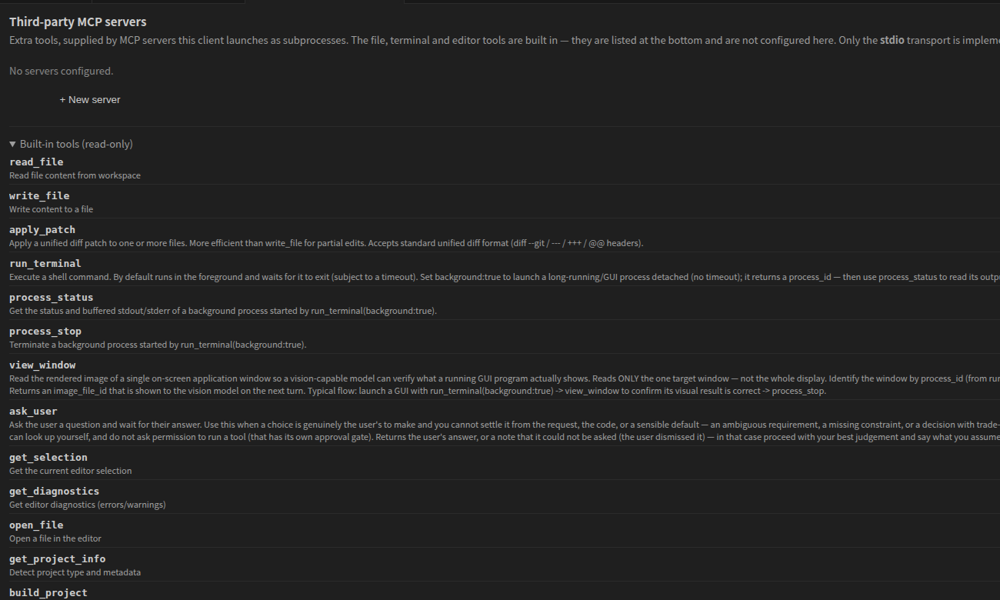

# Tools & Approval

Tool calls run **in your editor**, not on the server. When the model reads a
file it reads your workspace; when it runs a command it runs on your machine.

Two gates stand between the model and your project: **tool approval**, which
gates individual calls by tool, and **[file approval](file-approval.md)**, which
asks about every single file before it is written.

Which tools a node may use is set on the node — see **Enable Tool Calls** and
**Allowed Tools** in [Send To AI](nodes.md#send-to-ai).

*The built-in tools, as the model sees them — read-only, at the bottom of the
MCP servers page.*

---

## The built-in tools

| Tool | Approval | What it does |
|---|:---:|---|
| `read_file` | auto | Reads a file from your workspace |
| `write_file` | [per file](file-approval.md) | Writes a file, after you approve that file |
| `apply_patch` | [per file](file-approval.md) | Applies a unified diff, asking once per file it touches |
| `run_terminal` | **ask** | Runs a shell command. Can run in the background and return a process id |
| `process_status` | auto | Status and buffered output of a background process |
| `process_stop` | auto | Terminates a background process |
| `view_window` | auto | Reads the rendered image of one application window so a vision model can check what a running GUI actually displays |
| `ask_user` | auto | Puts a question to you and waits for the answer |
| `get_selection` | auto | The current editor selection |
| `get_diagnostics` | auto | Errors and warnings from the language server |
| `open_file` | auto | Opens a file, optionally at a line |
| `get_project_info` | auto | Detected project type and metadata |
| `remember` | auto | Records one durable note about a source file — why something was done, not what changed. Shown again in later sessions whenever that file is in play |
| `build_project` | **ask** | Builds with the detected build system |
| `run_tests` | **ask** | Runs the project's tests |

Build and test understand CMake, Unity, Unreal, Node, Cargo, Go and Make. Which
one runs is detected from the workspace; the specifics are configurable in
[Settings](settings.md).

`ask_user` is deliberately approval-exempt — asking your permission to ask you a
question would prompt twice for one interaction.

`view_window` reads a single named window, not the display, and is meant for one
job: launch a GUI with `run_terminal(background:true)`, have a vision model
confirm the window shows what it should, then `process_stop`.

The server also drives a hidden `scan_memory` tool as part of the project-memory
pipeline. It is not offered to the model and never asks for approval.

## The write tools have their own gate

`write_file` and `apply_patch` do not use `cage.toolApproval.perTool` at all.
Every file they touch is approved individually, immediately before it is
written, with that file's diff in front of you. There is no setting that makes
them automatic.

Approvals are serialised into one queue shared with tool approval, so only one
question waits on you at a time. See [File Approval](file-approval.md).

## Risk levels

Shown on the approval card to help you decide quickly:

| Level | Tools |
|---|---|
| 🔴 High | `run_terminal` |
| 🟡 Medium | `build_project`, `run_tests` |
| 🟢 Low | everything else |

`run_terminal` is the one that genuinely reaches outside. It runs a real command
on your machine, in your workspace root — it can reach the network, install
packages, and touch paths that no file gate sees.

## Approving

Requests appear inline in the chat panel with four choices:

| Choice | Scope |
|---|---|
| Allow | This call only |
| Allow this tool | Every later call to this tool, until the session ends |
| Allow all | Every later tool call, until the session ends |
| Deny | Refuses; the model is told and carries on |

Session grants reset with **New Session** — that is the way back if you allowed
more than you meant to.

## Approval modes

| Setting | Default | Meaning |
|---|---|---|
| `cage.toolApproval.mode` | `ask` | Default for every tool |
| `cage.toolApproval.perTool` | `run_terminal`, `build_project`, `run_tests` → `ask` | Per-tool overrides |
| `cage.toolApproval.timeoutSeconds` | 30 | How long a request waits before lapsing. `0` waits forever |

`auto` for everything means a model can run arbitrary commands on your machine
without asking. Reasonable in a scratch workspace; a poor trade in a repository
you care about.

## Command output

Long output is not pasted into the conversation. Past
`cage.tool.outputThresholdKB` (128 KB), the client uploads it as a file and
hands the model the exit code, a summary and a reference — so a noisy build does
not eat the context window.

Commands are killed at `cage.tool.commandTimeoutMs` (2 minutes); builds and
tests get `cage.build.timeoutMs` (10 minutes). Background processes started
with `run_terminal(background:true)` have no timeout and are yours to stop.

## Adding tools

Third-party tools attach over MCP and go through the same approval flow. See
[MCP Servers](mcp.md).

---

[← Chat Panel](chat-panel.md) · [File Approval](file-approval.md) · [MCP Servers](mcp.md) · [Settings](settings.md) · [Client Guide](README.md)
