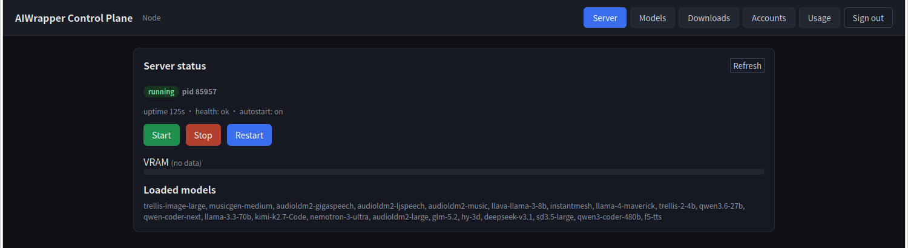
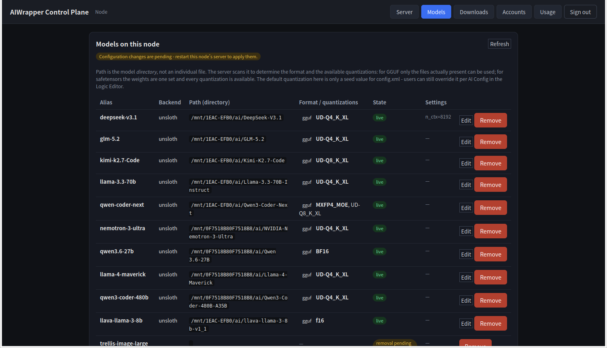

# Control Plane

`cage-launcher --control` is the web UI and the only piece that knows about more
than one machine. It holds the accounts, and it drives each machine through
that machine's [node agent](../agent/README.md).

```bash
cage-launcher --control --control-config /opt/cage/control.xml
```

Installed as the `cage-control` service. Open `http://<host>:8088/`.



*The Server tab: process state, uptime, health, and which models the running
server has loaded — start, stop and restart from here.*

---

## Contents

| Page | Covers |
|---|---|
| [Accounts](accounts.md) | Admin accounts, user accounts, tokens, the bootstrap account, what happens with no database |
| [Multiple nodes](nodes.md) | Adding machines, tokens, what is shared between them and what is not |

## What it can do



*The Models tab. Each entry is `live` (loaded by the running server) or pending
a restart — the banner appears whenever the config and the running server have
diverged.*

| Area | Actions |
|---|---|
| Server | Start, stop, restart the server on any node |
| Status | Process state, pid, uptime, health, VRAM, which models are loaded |
| Models | Add, edit, remove entries in a node's `config.xml`; see `live` vs `pendingRestart` |
| Downloads | Search Hugging Face, pick a quantization group, download to a chosen disk, watch progress |
| Disks | Free and total space per download directory |
| Accounts | Create and remove accounts, set passwords, issue tokens |

It does not run inference and it does not proxy client traffic. Editors connect
straight to the inference server; control is out of that path entirely.

## Configuration

```xml
<control>
  <web_port>8088</web_port>
  <bind>127.0.0.1</bind>

  <mysql>
    <host>127.0.0.1</host><port>3306</port>
    <user>cage</user><password>…</password>
    <database>cage</database><pool_size>2</pool_size>
  </mysql>

  <admin>
    <username>admin</username>
    <password>…</password>
  </admin>

  <nodes>
    <node id="local" name="local" url="http://127.0.0.1:15972" token=""/>
  </nodes>
</control>
```

| Field | Meaning |
|---|---|
| `web_port` / `bind` | Where the UI listens. `0.0.0.0` exposes it to the network |
| `mysql` | Accounts database — **must be the same database as the server's** |
| `admin` | Bootstrap account. See [Accounts](accounts.md) |
| `nodes` | The machines it manages. See [Multiple nodes](nodes.md) |

## The same database, twice

`<mysql>` appears in both `control.xml` and `config.xml`, and **they must point
at the same database**.

The two processes create the same repositories — users, tokens, sessions. Point
them at different databases and everything looks fine until a client tries to
log in: the account exists in the control plane's database and the server has
never heard of it.

If you change one, change the other.

## Securing it

The UI can start, stop and reconfigure every machine it knows about. Treat the
port accordingly:

- Bind to `127.0.0.1` and reach it over SSH when you can.
- Set a real admin password. An empty one disables authentication entirely.
- Give every node a `node_token`, not just the remote ones.
- Serve it behind a TLS-terminating proxy if it is exposed — the control plane
  speaks plain HTTP.

## When a node shows as unreachable

Control reaches agents over HTTP, so the usual suspects are ordinary network
ones:

1. Is the agent running on that machine? `systemctl status cage-agent`
2. Does the agent's `<bind>` allow a remote connection? `127.0.0.1` does not.
3. Does the `token` in `<nodes>` match that machine's `<node_token>`?
4. Is the port reachable? `curl http://<host>:15972/health`

A node being unreachable says nothing about whether its inference server is
running — clients connected to it keep working.

---

[← Server Guide](../README.md)
